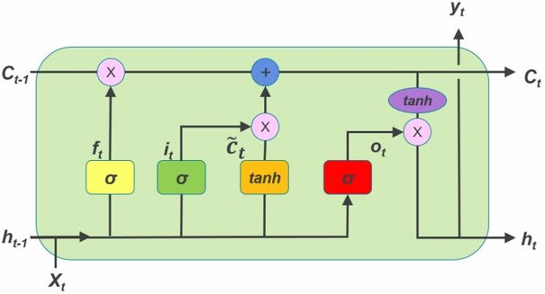
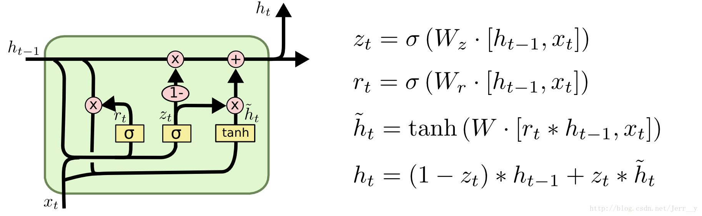

### RNNS

#### 1. RNN

- Pytorch nn.RNN()公式
  $$
  h_t = \tanh(w_{ih} x_t + b_{ih}  +  w_{hh} h_{(t-1)} + b_{hh})
  $$

#### 2. LSTM

- Pytorch nn.LSTM() 公式
  $$
  \begin{array}{ll}
              f_t = \sigma(W_{if} x_t + b_{if} + W_{hf} h_{(t-1)} + b_{hf}) & x_t,h{(t-1)}\rightarrow上一时刻记忆的衰减系数\\  i_t = \sigma(W_{ii} x_t + b_{ii} + W_{hi} h_{(t-1)} + b_{hi}) & x_t,h{(t-1)}\rightarrow当前学习到记忆的系数\\
  o_t = \sigma(W_{io} x_t + b_{io} + W_{ho} h_{(t-1)} + b_{ho})& x_t,h{(t-1)}\rightarrow输出门系数 \\g_t = \tanh(W_{ig} x_t + b_{ig} + W_{hg} h_{(t-1)} + b_{hg}) & x_t,h{(t-1)}\rightarrow当前学习到的记忆\\c_t = f_t c_{(t-1)} + i_t g_t&f_t, c(t-1),i_t,g_t\rightarrow当前记忆单元 \\            
               h_t = o_t \tanh(c_t)  & o_t,c_t\rightarrow当前输出\end{array}
  $$

#### 3. GRU

- Pytorch nn.GRU() 公式
  $$
  \begin{array}{ll}
              r_t = \sigma(W_{ir} x_t + b_{ir} + W_{hr} h_{(t-1)} + b_{hr}) & 此系数决定上一时刻输出对当前时刻学习到记忆的贡献\\
              z_t = \sigma(W_{iz} x_t + b_{iz} + W_{hz} h_{(t-1)} + b_{hz}) & 此系数决定当前时刻学习的内容和上一时刻输出对当前时刻输出的贡献比例\\ 
              n_t = \tanh(W_{in} x_t + b_{in} + r_t (W_{hn} h_{(t-1)}+ b_{hn})) & 当前学习到的内容\\
              h_t = (1 - z_t) n_t + z_t h_{(t-1)} & 当前时刻的输出\\
              \end{array}
  $$
  比较pytorch中的公式和图片中的公式，发现pytorch内置的GRU是使用了偏置的。

#### 4.比较

- 输入输出

  - 输入

    RNN、GRU输入为上一时刻的输出$h_{t-1}$和当前时刻输入$x_t$；

    而LSTM的输入除了$h_{t-1}$和$x_t$，还有上一个时刻输出的记忆$c_{t-1}$。

  - 输出

    RNN、GRU输出为$h_{t}$；

    LSTM输出为$h_{t}$和$c_t$。

- 结构方面

  LSTM有输入门、遗忘门、输出门；GRU有更新门和输出门。这些门结构由计算公式中系数体现。

- 性能方面

  RNN具有短期记忆的特点，序列足够长时会遗漏较早时刻的信息；

  LSTM和GRU通过门的内部机制，可以调节信息流，能对较长的序列进行有效学习。

**参考链接**

http://imgtec.eetrend.com/d6-imgtec/blog/2018-10/18051.html