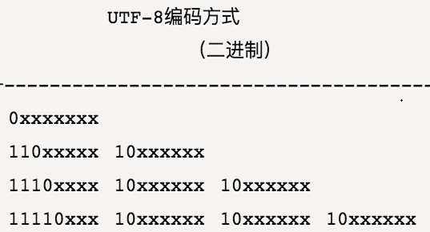

### 关于字符编码的那些事

#### 1.为什么需要字符编码

​	计算机中只能存储的0和1，对于一个英文、汉语等字符，只有将其编码成01串才能传入计算机。因此，我们需要定义一套**编码规则**，能将不同的字符转换成不同的01串。为了描述这个编码规则，进而又产生了**编码字符集**和**字符编码方式**这两个概念。

#### 2.编码字符集、字符编码方式

##### (1 编码字符集和字符编码的关系

​	一个编码字符集可以有一种或者多种字符编码方式。比如编码字符集ASCII只有一种字符编码方式，也叫ASCII；Unicode有3种字符编码方式，分别为UTF-8，UTF-16，UTF-32。

##### 	(2 编码字符集

​	常见的字符编码集有**ASCII**、**Unicode**、**GBK**等。

​	一个编码字符集往往是针对一种或者多种语言设计的，不同的编码字符集由于其针对的语言不同，所能表示的字符的数量和种类是不同的，比如ASCII只能表示128个英语中的字符，而面像中文的GBK能表示数万个中文字符。

​	在编码字符集中，用一个**编码值**来表示一个字符，而这个编码值就是该字符在编码字符集中的序号（从0开始）。例如，下图中的ASCII编码字符集，字符**NUT**的编码值为0，字符**SOH**的编码值为0。

##### (3 字符编码

​	通过编码字符集，我们可以给每个字符指定了一个编码值。但是，如果只是简单地将字符对应的编码值的二进制数输入给计算机，计算机面对由很多字符构成的文本对应的长长的01串，怎么确定某个字符对应的01串的开始和终止位置。因此，我们还需要规定每个字符对应01串的长度，即我们用几个bit来表示一个字符的编码值。这就引入了**字符编码**的概念。对于**用几个bit来表示一个字符的编码值的问题**，有如下两种方案：

###### 	①统一长度字符编码方式

​	取编码字符集中编码值最大的字符对应二进制数的长度，或者大于该长度的一个值。然后所有的字符的编码值都填充到该长度，才能输入计算机。

​	比如，**ASCII**编码字符集，最大编码值为127，因此，对于ASCII中的每一个字符，我们至少需要7个二进制位来表示。而实际上，ASCII的**字符编码**是采用一个字节（8个二进制位）表示一个字符。

​	但是，统一长度字符编码方式，存在着存储空间浪费的问题。对于编码值很小的字符，也必须填充到相应长度，填充部分的空间是浪费的。这种浪费，在编码字符集很大时更为明显。因此，又产生了变长字符编码方式。

###### 	②变长字符编码方式

​	对编码字符集的编码值进行分段，处于不同段的字符，用不同长度的二进制位表示。

​	比如，Unicode编码字符集的**UTF-8字符编码**方式， 它可以使用1~4个字节表示一个符号，根据不同的符号而变化字节长度。

​	对于变长的字符编码方式怎么让计算机识别一个字符的开始和结束的问题，后面以utf-8为例进行说明。

#### 3.ASCII

​	早期的计算机系统只能处理英文，所以ASCII也就成为了计算机的缺省编码字符集，包含了英文所需要的所有字符。

​	ASCII 编码字符集一共规定了**128个字符**的编码，使用一个字节（即8个二进制位）来表示一个字符的字符编码方式。比如空格SPACE是的ASCII码值是32，对应8位二进制编码为00100000。这128个符号（包括32个不能打印出来的控制符号），只占用了一个字节的后面**7位**，最前面的一位统一规定为0。

​	ASCII的字符编码方式也叫ASCII，故ASCII既是编码字符集，又是字符编码。

#### 4.Unicode

##### (1 为什么会产生Unicode

​	有时候我们在一个文件中需要同时使用多种语言，比如，同时使用英文和中文字符，这是我们仅仅用针对英文的ASCII编码是不够的。我们更希望有一种编码字符集能够囊括世界上的各种语言的各种符号，所以unicode就出现了。Unicode全称Universal Multiple-Octet Coded Character Set，简称UCS。

##### (2 Unicode的两种形式

​	Unicode有UCS-2和UCS-4两种形式，UCS-2是用2个字符表示一个字符，而UCS-4是用4个字符表示一个字符，因此UCS-4能表示的字符更多。一般，默认Unicode是UCS-2。

​	**note**：UCS只是Unciode编码值的一种表示，并非指Unicode在计算机中实实在在的表示方式，UTF才是。

##### (3 Unicode的编码方式

​	Unicode有三种字符编码方式，UTF-8【1~4个字节表示一个字符】，UTF-16【2或4个字符表示一个字节】，UTF-32【4个字节表示一个字符】。

​	**UTF-8**是互联网上使用最广的一种unicode的实现方式。UTF-8 的编码规则：

1. 对于单字节的符号，字节的第一位设为0，后面7位为这个符号的 Unicode 码。【因此对于英语字母，UTF-8 编码和 ASCII 码是相同的。即UTF-8能很好的**兼容ASCII**】

2. 对于n字节的符号（n > 1），第一个字节的前n位都设为1，第n + 1位设为0，后面字节的前两位一律设为10。剩下的没有提及的二进制位，全部为这个符号的 Unicode 码。【如果一个字节的第一位是0，则这个字节单独就是一个字符；如果第一位是1，则连续有多少个1，就表示当前字符占用多少个字节。】

##### (4 UTF-16的字节序和BOM

​	UTF-16以两个字节为编码单元，如“奎”的Unicode编码是594E，对应UTF-16字节流可以是594E，也可以是4E59。对于unicode编码的文件，统一在文件开头加上一个**BOM**的字段，当BOM为FEFF时，表示UTF-16字节流是高字节在前，低字节在后，此种字节序称为**Big-Endian**；当BOM为FFFE时，表示UTF-16字节流是低字节在前，高字节在后，此种字节序称为**Little-Endian**。

​	UTF-8，以字节为编码单元，没有字节序的问题【就是默认都是高字节在前】。一般也用BOM为EFBBBF来指定该文本或者字节流是UTF-8的编码方式。即，当一个字节流以EF BB BF开头，就表示这是UTF-8编码。

​	**note**：用户实际并不会看到BOM对应的字符。

#### 5. 参考：

www.fmddlmyy.cn/text6.html

https://www.cnblogs.com/gavin-num1/p/5170247.html

https://blog.csdn.net/yo746862873/article/details/51780894

