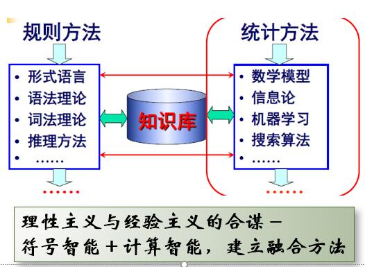
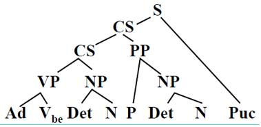
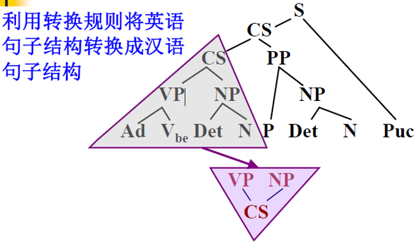
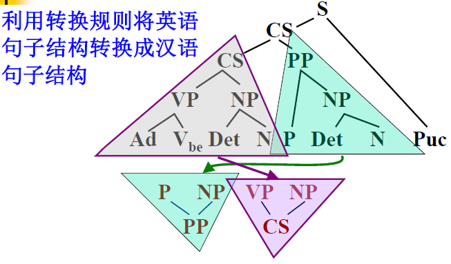
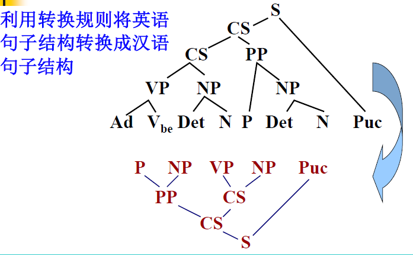
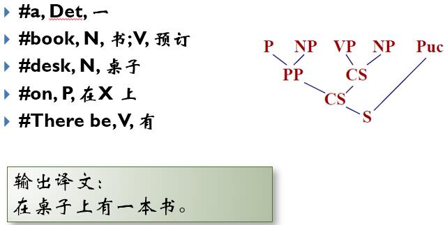
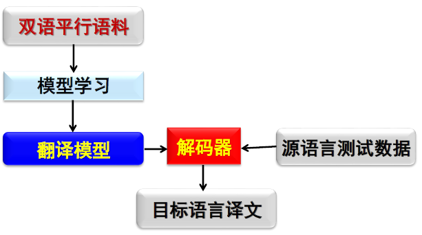
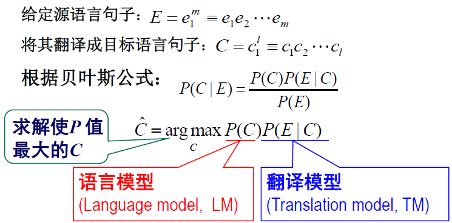
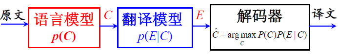

### 一、引言

- 问题提出
- 基本概念
- 主要研究内容
- 面临的主要困难
- 基本方法和发展历史
- 研究现状
- 参考文献

#### 1 问题提出

- 任意时间、任意地点、任意语言的自由通讯无时无刻不在改变着人们的思维方式和生活方式；
- 语言是思维的载体，是人类交流思想、表达情感最自然、最直接、最方便的工具；
- 人类历史上以语言文字形式记载和流传的知识占知识总量的**80**％以上；
- 2008年1月中国互联网络信息中心(CNNIC) 发布的《第21次中国互联网络发展状况统计报告》表明，中国互联网上有87.8%的网页内容是文本表示的。

面对文本大数据，我们面临怎样的机遇和挑战？

人们处在不同的国家，使用不同的语言，在不同的地方发表过不同的言论(专著、论文、博客、网页等)，千丝万缕的关系将他们联系在一起，构成一个特定的社会网络。如何发现或挖掘这种网络？如何确定不同的实体、事件和知识之间的关联？

如何让计算机能够自动或半自动地理解自然语言文本，懂得人的意图和心声？

如何让计算机实现海量语言文本的自动处理、挖掘和有效利用，满足不同用户的各种需求，实现个性化信息服务？

————**自然语言处理**，**Natural Language Processing， NLP**

#### 2 基本概念

语言学、语音学；自然语言理解、自然语言处理、计算语言学、中文信息处理

##### 2.1 语言学**(linguistics)**  

- 语言学是指对语言的科学研究。——戴维•克里斯特尔，《现代语言学词典》，1997

- 研究语言的本质、结构和发展规律的科学。——商务印书馆，《现代汉语词典》，1996
- **语音**和**文字**是**语言的两个基本属性**。
- 作为一门纯理论的学科，语言学在近期获得了快速**发展**，尤其从上个世纪60年代起，已经成为一门知晓度很高的广泛教授的学科。包括
  1. 历时语言学(diachronic linguistics)或称历史语言学(historical linguistics)  
  2. 共时语言学(synchronic linguistics)
  3. 描述语言学(descriptive linguistics)
  4. 对比语言学(contrastive linguistics)
  5. 结构语言学(structural linguistics) 等等。

##### 2.2 语音学**(phonetics)**

- 研究人类发音特点，特别是语音发音特点，并提出各种语音描述、分类和转写方法的科学。

- 包括: 

  1. 发音语音学(articulatory phonetics)，研究发音器官如何产生语音；

  2. 声学语音学(acoustic phonetics)，研究口耳之间传递语音的物理属性；

  3. 听觉语音学(auditory phonetics), 研究人通过耳、听觉神经和大脑对语音的知觉反应。

     ——戴维•克里斯特尔，《现代语言学词典》，1997

- 问题：语音学究竟是一门独立的学科还是应视为语言学的一个分支呢？

  ​     复数的语言科学(linguistic sciences)

##### 2.3 计算语言学(Computational Linguistics)

通过建立形式化的计算模型来分析、理解和生成自然语言的学科，是人工智能和语言学的分支学科。计算语言学是典型的交叉学科，其研究常常涉及计算机科学、语言学、数学等多个学科的知识。与内容接近的学科自然语言处理相比较，计算语言学更加侧重基础理论和方法的研究。——《计算机科学技术百科全书》(常宝宝)

1960S，形成相对独立的学科。1962年国际计算语言学学会(ACL)成立，1965年国际计算语言学委员会(ICCL)成立，1966年“计算语言学”首次出现在美国国家科学院ALPAC报告里。

##### 2.4 自然语言理解**(Natural Language Understanding, NLU)**

自然语言理解是探索人类自身语言能力和语言思维活动的本质，研究模仿人类语言认知过程的自然语言处理方法和实现技术的一门学科。它是人工智能早期研究的领域之一，是一门在语言学、计算机科学、认知科学、信息论和数学等多学科基础上形成的交叉学科。——《计算机科学技术百科全书》(宗成庆)

自然语言理解是人工智能最重要的研究方向之一，是当今“人工智能皇冠上的明珠”。

关于“理解”的标准

- 如何判断计算机系统的智能？计算机系统的表现**(act)**如何？反应**(react)**如何？相互作用**(interact )**如何？

- 与有意识的个体（人）比较如何？
- 图灵设计的“模仿游戏”——图灵实验**(Turing test)**

##### 2.5 自然语言处理**(Natural Language Processing, NLP)**

自然语言处理是研究如何利用计算机技术对语言文本（句子、篇章或话语等）进行处理和加工的一门学科，研究内容包括对词法、句法、语义和语用等信息的识别、分类、提取、转换和生成等各种处理方法和实现技术。——《计算机科学技术百科全书》(宗成庆)

1980S，面向计算机网络和移动通信，从系统实现和语言工程的角度开展语言信息处理方法的研究。专门针对中文的语言信息技术研究成为中文信息处理。

- **三个不同的语系**

  1. 屈折语(fusional language/ inflectional language):用词的形态变化表示语法关系，如英语、法语等。
  2. 黏着语(agglutinative language):词内有专门表示语法意义的附加成分，词根或词干与附加成分的结合不紧密，如日语、韩语、土耳其语等。、
  3. 孤立语(analytic language)(分析语, isolating language):形态变化少，语法关系靠词序和虚词表示，如汉语。

- 汉语：汉族的语言，是我国的主要语言。

- 中文：中国的语言文字，特指汉族的语言文字。——《现代汉语词典》，1996

- **中文信息处理(Chinese Information Processing)**

  针对中文的自然语言处理技术。

近几年来，自然语言处理技术迅速发展成为一门相对独立的学科，倍受关注，而且该技术不断与语音技术相互渗透和结合形成新的研究分支，因此，很多人在谈到**“计算语言学”、“自然语言处理”或“自然语言理解”这些术语时，往往默认为同一个概念。**甚至有专著[刘颖，2002]干脆直接解释为：计算语言学也称自然语言处理或自然语言理解。

#### 3 HLT的产生与发展

人类语言技术(Human Language Technology，HTL)

##### 3.1 相关组织

- 1962年美国成立“机器翻译和计算语言学协会(Association for Machine Translation and Computational Linguistics)”并组织召开了第一届国际计算语言学学术年会(ACL)
- 1965年杂志*Machine Translation* 改名为Machine Translation and Computational Linguistics
- 1965年成立国际计算语言学委员会(The International Committee on Computational Linguistics, ICCL)，并组织召开了第一届国际计算语言学大会(The International Conference on Computational Linguistics, COLING)
- 1966年术语Computational Linguistics 正式出现在ALPAC (Automatic Language Processing Advisory Committee)中

##### 3.2 曲折的发展历程  

- 1960S 中期之前：萌芽期

- 1960S 中期到1970S 中后期：步履维艰

  1966年美国科学院发表ALPAC报告

- 1970S 中后期到1980S 后期：复苏

- 1980S至2010左右：快速发展

- 2010至今：繁荣时期

#### 4 主要研究内容 

##### 4.1 按照应用目标划分，广义上包括  

1. **机器翻译**(Machine translation, MT)

   - **概念**：实现一种语言到另一种语言的自动翻译。

   - **应用**：文献翻译、网页辅助浏览等。

   - **代表系统**：

     Google：http://translate.google.cn (103种语言)

     百度：http://fanyi.baidu.com (28种语言，包括文言文和简繁转换)

     Systran：[http://www.systransoft.com](http://www.systransoft.com/)

     有道：http://fanyi.youdao.com/

     小牛翻译：https://niutrans.vip/console/textTrans

   - 机器翻译研究现状和对机器翻译的认识

     机器翻译研究在过去五十多年的曲折发展经历中，无论是它给人们带来的希望还是失望我们都必须客观地看到，机器翻译作为一个科学问题在被学术界不断深入研究的同时，企业家们已经从市场上获得了相应的利润。

     在机器翻译研究中实现人机共生(man-machine symbiosis)和人机互助，比追求完全自动的高质量的翻译(Full Automatic High Quality Translation, FAHQT) 更现实、更切合实际[Hutchins, 1995]

2. **信息检索**(Information retrieval)

   - **概念**：信息检索也称情报检索，就是利用计算机系统从大量文档中找到符合用户需要的相关信息。

   - **代表系统**：

     Google: [http://www.google.com](http://www.google.com/)

     百度：http://www.baidu.com.cn

   - 目前至少有300多亿个网页，每天数以万计地增加，只有1％的信息被有效地利用。

3. **自动文摘**(Automatic summarization / Automatic abstracting)

   - **概念**：将原文档的主要内容或某方面的信息自动提取出来，并形成原文档的摘要或缩写。
   - **观点挖掘**(Opinion mining) 。
   - **应用**：电子图书管理、情报获取等。

4. **问答和对话系统**(Question-answering system)

   - **概念**：通过计算机系统对人提出的问题的理解，利用自动推理等手段，在有关知识资源中自动求解答案并做出相应的回答。问答技术有时与语音技术和多模态输入/输出技术，以及人机交互技术等相结合，构成人机对话系统(man-computer dialogue system)。

   - **社区问答**(Community Question Answering, CQA)

     百度知道：用户群体智慧

     IBM Watson 自动问答系统

5. **信息过滤**(Information filtering)

   通过计算机系统自动识别和过滤那些满足特定条件的文档信息。

6. **信息抽取**(Information extraction)

   - **概念**：从指定文档中或者海量文本中抽取出用户感兴趣的信息。

   - **实体关系抽取**(entity relation extraction)。

   - **社会网络**(social network)

7. **文档分类**(Document categorization)

   - **概念**：文档分类也叫文本自动分类(Text categorization / classification)或信息分类(Information categorization / classification)，其**目的**就是利用计算机系统对大量的文档按照一定的分类标准（例如，根据主题或内容划分等）实现自动归类。
   - **情感分类**(Sentimental classification)
   - **应用**：图书管理、情报获取、网络内容监控等。

8. **文字编辑和自动校对**(Automatic proofreading)

   - **概念**：对文字拼写、用词、甚至语法、文档格式等进行自动检查、校对和编排。
   - **应用**：排版、印刷和书籍编撰等。

9. **语言教学**(Language teaching)

10. **文字识别**(Character recognition)

11. **语音识别**(automatic speech recognition, ASR)

    - **概念**：将输入语音信号自动转换成书面文字。
    - **应用**：文字录入、人机通讯、语音翻译等等。
    - **困难**：大量存在的同音词、近音词、集外词、口音等等。

12. **文语转换/ 语音合成**(text-to-speech synthesis)

    - **概念**：将书面文本自动转换成对应的语音表征。
    - **应用**：朗读系统、人机语音接口等等。

13. **说话人识别/认同/验证**(speaker recognition/ identification/ verification)

    - **概念**：对一言语样品做声学分析，依此推断(确定或验证)说话人的身份。
    - **应用**：信息安全、防伪等等。  

**说明**

- 由于不同的研究方向所关注的侧重点不同，因此，一般将语音识别、语音合成和说话人识别等以语音信号为主要研究对象的语音技术独立出来，而其他**以文本(词汇/句子/篇章等)为主要处理对象的研究内容作为自然语言处理的主体**。

- 文字识别更多地**涉及图像识别**与理解的问题。**信息检索与自然语言处理**之间既有密切关联，又各自相对独立，我们暂且回避它们之间关系的争论。

#### 5 **基本问题和主要困难**  

##### 5.1 基本问题

1. **形态学(Morphology) 问题**

   研究词(word) 有意义的基本单位——**词素**(morphemes)的构成问题。

   词素：词根、前缀、后缀、词尾

   如：单词的识别/ 汉语的分词问题。

2. **句法(Syntax) 问题**

   研究句子结构成分之间的相互关系和组成句子序列的规则。

   为什么一句话可以这么说也可以那么说？如何建立快速有效的句子结构分析方法？

   如：$“苹果，我吃了。”=“我吃了苹果。”\not=“苹果吃了我。”$

3. **语义(Semantics) 问题**

   研究如何从一个语句中词的意义，以及这些词在该语句中句法结构中的作用来推导出该语句的意义 。

   这句话说了什么？

4. **语用学(Pragmatics) 问题**

   研究在不同上下文中语句的应用，以及上下文对语句理解所产生的影响。从狭隘的语言学观点看，语用学处理的是语言结构中有形式体现的那些语境。相反，语用学最宽泛的定义是研究语义学未能涵盖的那些意义。

   为什么要说这句话？

5. **语音学(Phonetics) 问题**

   研究语音特性、语音描述、分类及转写方法等。

##### 5.2 主要困难

1. **大量歧义(ambiguity)现象**

   - **词法歧义**

     例如：门把手弄坏了——（1）
     门/ 把/ 手/ 弄/ 坏/ 了
     （2）门把手/ 弄/ 坏/ 了

   - **词性歧义**

     例如：

     (1)Time flies like an arrow. 

     - like：①介词：像，好似；②动词：喜欢

     -  flie：①动词：飞，飞翔，飞驰; ②名词：苍蝇，飞虫
       时间像箭一样飞驰（光阴似箭）。
     - 时间苍蝇喜欢箭（有一种苍蝇叫“时间”）。
     - 时间苍蝇喜欢箭（有一种苍蝇叫“时间”）。

     (2) “动物保护警察”明年上岗

   - **结构歧义**

     (1) 喜欢乡下的孩子。

     (2) 关于鲁迅的文章。

     (3) 今天中午吃馒头。

     (4) 今天中午吃食堂。

     (5) 今天中午吃大碗。

     (6) 今天中午吃了闭门羹。

     (7) 写文章/ 写毛笔/ 写黑板

     (8) I saw a man with a telescope. 

     - I saw [a man with a telescope]. 
     - I [saw a man] with a telescope. 

   - **语义歧义**

     (1) 例：

     他说：“她这个人真有意思(funny)”。

     她说：“他这个人怪有意思的(funny)”。

     于是人们以为他们有了意思(wish)，并让他向她意思意思(express)。

     他火了：“我根本没有那个意思(thought)” ！

     她也生气了：“你们这么说是什么意思(intention)”？

     事后有人说：“真有意思(funny)”。也有人说：“真没意思(nonsense)”。

     ——《生活报》1994. 11. 13. 第6版

     (2) 人们的语言表达中大量地使用缩略语和隐喻的表达方式  

     如：①要把权力装进制度的笼子；老虎苍蝇一起打。②破四旧，除四害；消灭一切牛鬼蛇神。

   -  **语音歧义**  (大量同音现象)

     例：施氏食狮史

     石室诗士施氏，嗜狮，誓食十狮。氏时时适市视狮，十时，适十狮适市，是时，适施氏适市，施氏视是十狮，拭矢试，使是十狮逝世，适石室，石室湿，氏使侍拭石室，石室拭，始食是十狮尸，始识是十狮尸，实十石狮尸，试释是事。

   - **多音字及韵律等歧义**(语音合成面临的诸多问题 )

     (1)一字多音
     例如：尾巴、亲家、削铅笔、一行

     (2) 韵律、声调、语气、重音
     例如：药材好药才好。

2. **大量未知语言现象**  

   - **新词、人名、地名、术语等**

     如: 裸退、非典、夏天、高山、温馨、时光、吉林、不来梅、失联

   - **新含义**

     如：苹果、奔腾、同志、小姐、老虎、苍蝇等

   - **新用法和新句型等**

     尤其在口语中或部分网络语言中，不断出现一些“非规范的”新的语句结构。
     如：被长工资，很中国，百度一下

**归纳起来，NLU 所面临的挑战：**

- 普遍存在的不确定性：词法、句法、语义、语用和语音各个层面
- 未知语言现象的不可预测性：新的词汇、新的术语、新的语义和语法无处不在
- 始终面临的数据不充分性：有限的语言集合永远无法涵盖开放的语言现象
- 语言知识表达的复杂性：语义知识的模糊性和错综复杂的关联性难以用常规方法有效地描述，为语义计算带来了极大的困难

**人脑理解语言是一个复杂的思维过程**

- －语言学、心理学
- －逻辑学、认知科学
- －计算机科学
- －统计学、信息论
- －背景知识、常识等

人脑的语言认知过程到底怎样？

#### 6 基本研究方法

- 理性主义  

  通常通过一些特殊的语句或语言现象的研究来得到对人的语言能力的认识，而这些语句和语言现象在实际的应用中并不常见。

  **问题求解的基本思路**：**基于规则**的分析方法建立符号处理系统。包括①规则库开发②词典标注③}推导算法设计：归约、推导、歧义消解方法…

  **理论基础**：Chomsky 的文法理论

  **知识库＋推理系统$\to$NLP 系统**

- 经验主义  

  偏重于对大规模语言数据中人们所实际使用的普通语句的统计。  

  **求解问题的基本思路**：**基于大规模真实语料**(语言数据)建立计算方法。包括①大规模真实数据的收集、标注：真实性、代表性、标注信息…②统计模型建立：模型的复杂性、有效性、参数训练方法…

  **理论基础**：统计学、信息论、机器学习

  **语料库＋统计模型$\to$NLP 系统**

- 以机器翻译为例

  给定英语句子：
  There is a book on the desk.
  将其翻译成汉语。

  **(1) 基于规则的方法**

  ① 对英语句子进行词法分析

  ​    There/Ad is/Vbe a/Det book/N on/P the/Det desk/N ./Puc

  ② 对英语句子进行句法结构分析

  

  ③ 利用转换规则将英语句子结构转换成汉语句子结构

  

  

  

  ④ 根据转换后的句子结构，利用词典和生成规则生成翻译的结果句子

  

  **(2) 数据驱动的翻译方法**（如SMT和NMT）

  

  **(3) 基于统计的方法**

  

  构建解码器(**decoder)**，快速搜索最优翻译候选：

  

  三个关键问题：

  - 估计语言模型概率p(C)； 

  - 估计翻译模型概率p(E|C)；

  - 快速有效地搜索候选译文C，使p(C)×p(E|C)最大。

  主要任务：

  - 收集大规模双语句子对、目标语言句子
  - 参数训练与模型优化

#### 7 研究现状

各种理论问题：
从词法(汉语分词)到语义……

各种应用系统：
从机器翻译到信息抽取……

**哪个问题都没彻底解决！**

**基本现状**

- 部分问题得到了解决，可以为人们提供辅助性帮助，如：专业领域文档翻译，电子词典，搜索引擎，文字录入等；
- 基础问题研究仍任重而道远，如：语义表示和计算、高质量的自动翻译等；
- 社会需求日益迫切：信息服务、通讯、网络内容管理、情报处理、国家安全等;
- 许多技术离真正实用的目标还有相当的距离，尚未建立起有效、完善的理论体系。

#### 8 课程内容

- 背景知识
  - 概率论、信息论、建模方法基础
  - 基本的语言学知识
  - 算法分析基础、编程能力
- 目的
  - 掌握自然语言理解的基本概念、理论、方法
  - 掌握正确分析问题、解决问题的思维方式