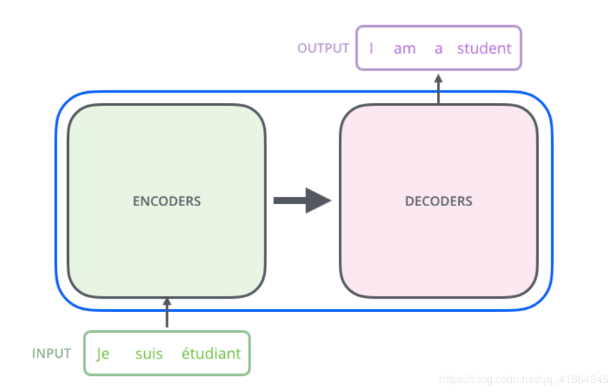
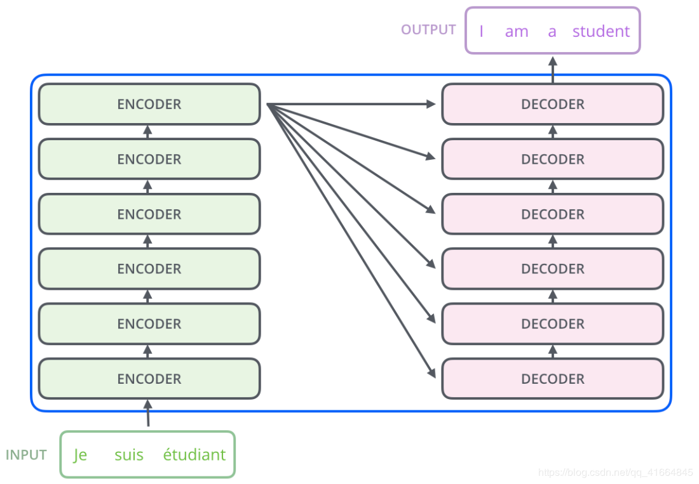
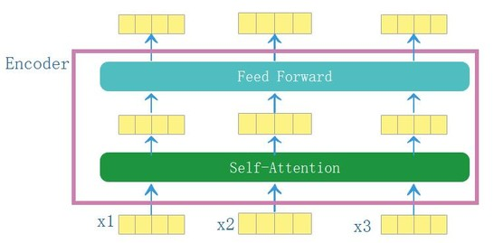
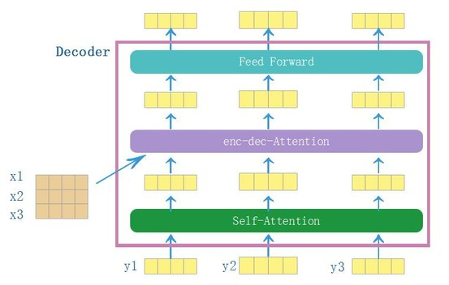
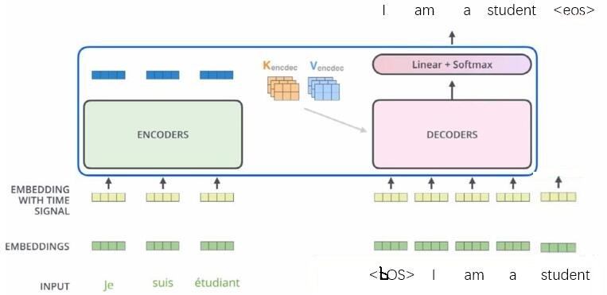
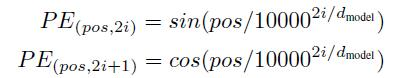
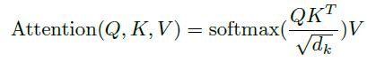
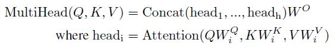
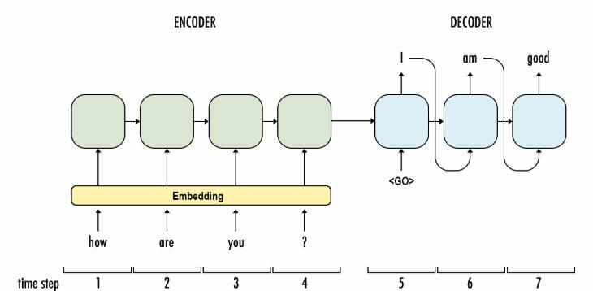
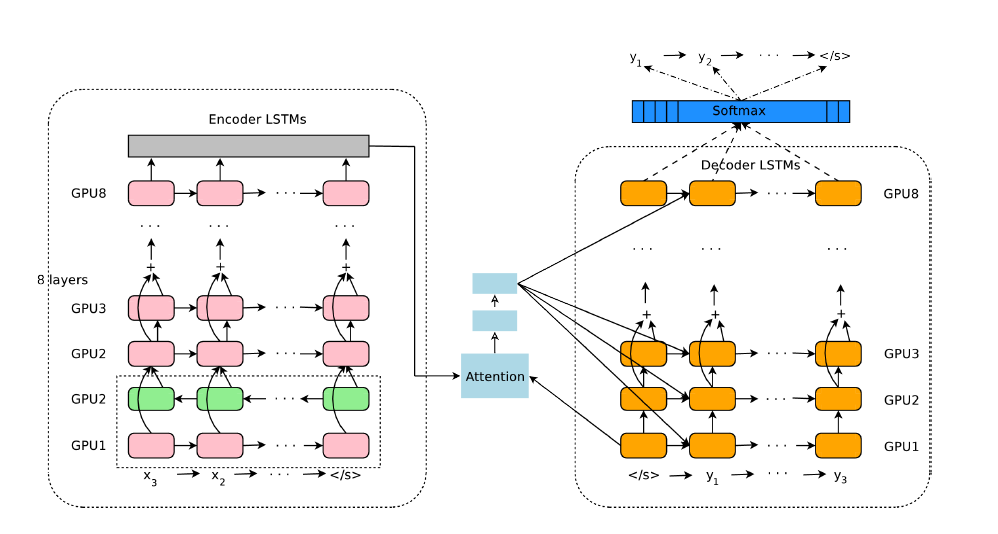

### Transformer报告

分享人————<b>甘国兵</b>

#### 1. transformer整体架构

（1）由Encoders和Decoders两部分组成

（2）Encoders和Decoders分别由6个相同结构的Encoder和Decoder构成

​	ENCODER结构【图中省略了*residual*和*layernorm*】

​	DECODER结构【图中省略了*residual*和*layernorm*】

​	transformer【以二层为例】

论文原图

###### Attention计算在干什么

Attention计算的**输入**有当前句子的向量表示**Q**，参考句子的向量表示**K**，参考句子的另外一个向量表示**V**。**输出**的是当前句子新的向量表示**Z**。也就是对当前句子的每一个单词向量进行更新。

- 当Q=K=V，**→→** Self-Attention
- 当Q=目的句子向量，K=V=源句子向量，**→→**Encoder-Decoder Attention

###### Attention计算的过程

- 公式

  $$Attention(Q,K,V)​$$

  $$\longrightarrow  Q=QW^Q,K=KW^K,V= VW^V​$$

  $\longrightarrow  attn=softmax(\frac{QK^T}{\sqrt{d_k}})​$

  $\longrightarrow Z=attnV​$

  对公示的简单理解：Q、K用来求权重，然后利用此权重对V进行加权平均得到Q的新表示Z。

- 具体过程

$\longrightarrow​$先分别对Q，K，V做一个普通的线性变换得到新的Q，K，V，其中**要求Q，K映射到相同的维度**。

$\longrightarrow​$当前句子某一个单词向量$Q_i​$的更新过程如下：

拿$Q_i$分别和参考句子的单词向量$K_j$（j=1，...，$len(K)$）做点乘，得到一个长度为参考句子单词数量的向量，然后用$softmax$将这个向量转化成具有相对概率的权重向量$attn_i$（len($attn_i$)=len(Q)，$attn_i$的一个元素$attn_{ij}$表示参考句子的第$j$个单词对当前句子的第$i$个单词的权重），然后利用$attn_i$对参考句子的另外一个向量表示$V$进行加权平均，得到$Z_i$。

#### 2. 训练和翻译的区别

训练：

**note**：

训练时，为了加快训练速度，decoder的输入直接就是bos+目的句子，为了模拟逐个单词翻译的过程，加入了masked—attention。

翻译时，decoder仍然按照seq2seq中decoder的方式，逐个单词翻译。

#### 3.transformer pytorch版代码

###### (1 Positional Encoding

​	Model.py	**get_sinusoid_encoding_table()**

$$\longrightarrow cal\_angle(pos,2i) =\frac{pos}{10000^{\frac{2i}{d_{model}}}},PE(pos,2i)=sin( cal\_angle(pos,2i))​$$

$$\longrightarrow cal\_angle(pos,2i+1) =\frac{pos}{10000^{\frac{2i}{d_{model}}}},PE(pos,2i)=cos( cal\_angle(pos,2i))$$						

###### (2 Multi—Head Attention

​	①attention

​		Modules.py	**ScaledDotProductAttention()**

​	

​	②MultiHeadAttention

​		Sublayer.py	**MultiHeadAttention()**

###### (3 FeedForward

Sublayer.py 	**PositionwiseFeedForward()**	

###### (4 Encoder,Decoder

Layers.py	EncoderLayer()	DecoderLayer()

###### (5 Encoders,Decoders

Models.py	Encoder()	Decoder()

###### (6 Transformer

Models.py	Transformer()

#### 4. transformer，seq2seq ranslation和GNMT比较

###### （1）seq2seq translation模型架构

###### （2）GNMT模型架构

###### （3）三者比较

- 相同

①三者主体都是由encoder和decoder两部分构成。

②都是先通过encoder对源句子进行一个表示，得到一个叫encoder_outputs的输出，然后将这个输出或者输出的一部分作为decoder的部分输入，然后对目的句子进行预测。

- 差异

①transformer的encoder和decoder分别分成了6个子层，每个子层的结构相同。 这种层与层的堆叠方式类似于8层的**GNMT**的结构，而不再像seq2seq只是一层结构transformer。

②transformer的子层**没有**使用具有循环结构的**RNNs**的结构，所以它比seq2seq translation，GNMT**快**。【**训练时**transformer的快在encoder和decoder上均有体现，但是**翻译时**，decoder可能比RNNs的方法还慢】

②最朴素的seq2seq translation只是把最后一个单词的encoder_output喂给decoder；而transformer是把所有单词的encoder_output以attention的方式喂给decoder，这一点也和GNMT类似。

