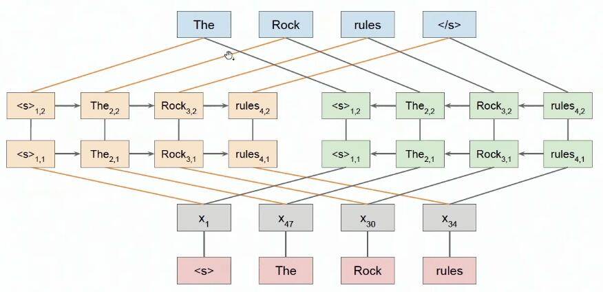
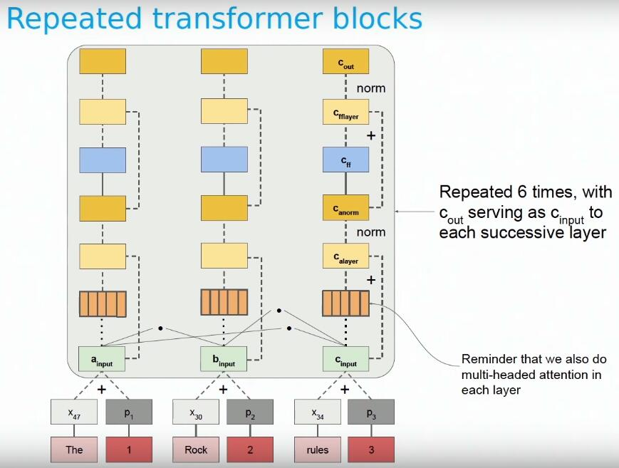
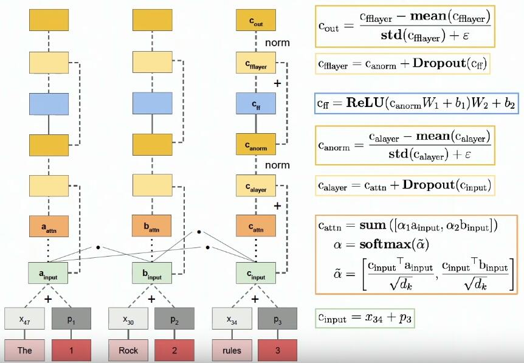
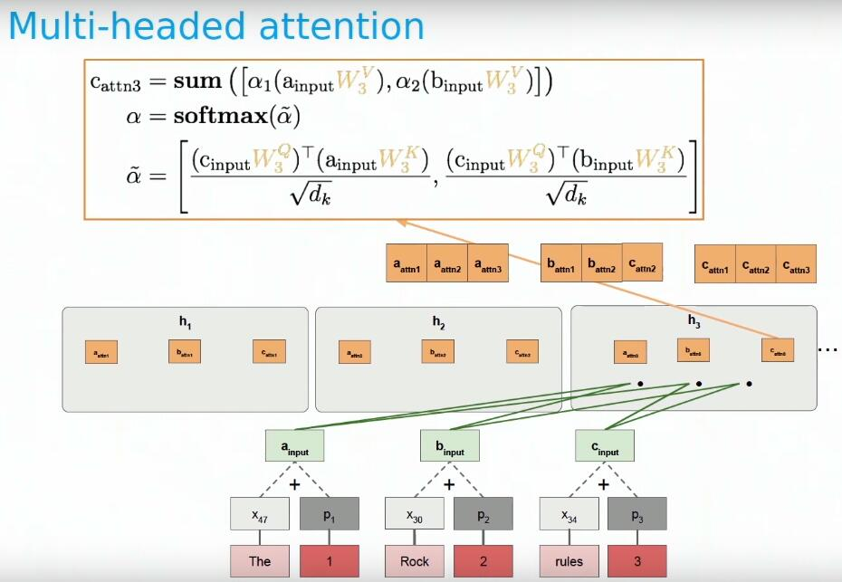
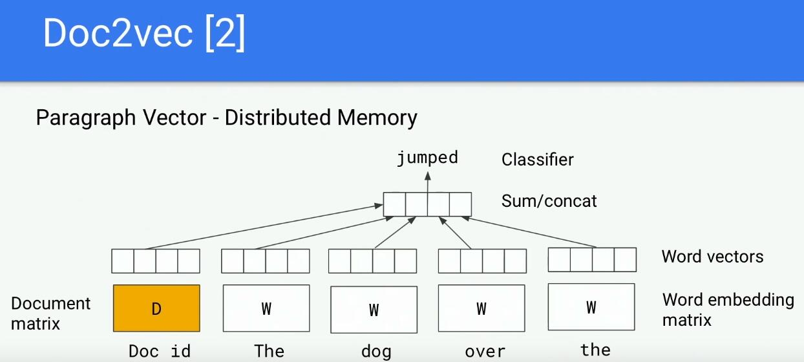

预训练模型：关注特征提取器、预训练任务。

特征提取器：CNN、FNN，RNN，transformer

 预训练任务 ：前n个词->后一个词、上下文->中心词，自回归、自编码

### ELMO

 (Embeddings from Language Models)

1. char-embedding ，conv（不同尺寸的卷积核，max-pooling后concat）—>word-embedding
2. word-embedding 经过 highway net
3. …
4. 如下应用到下游任务

### Transformer

### doc2vec

wordembedding：[vocab_size, word_embedding_size] 

docembedding：[doc_size, doc_embedding_size] 

用[word_embedding_size+doc_embedding_size] 去预测中心词

