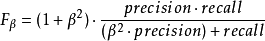
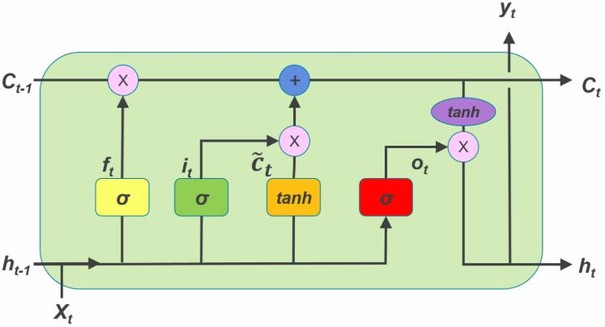
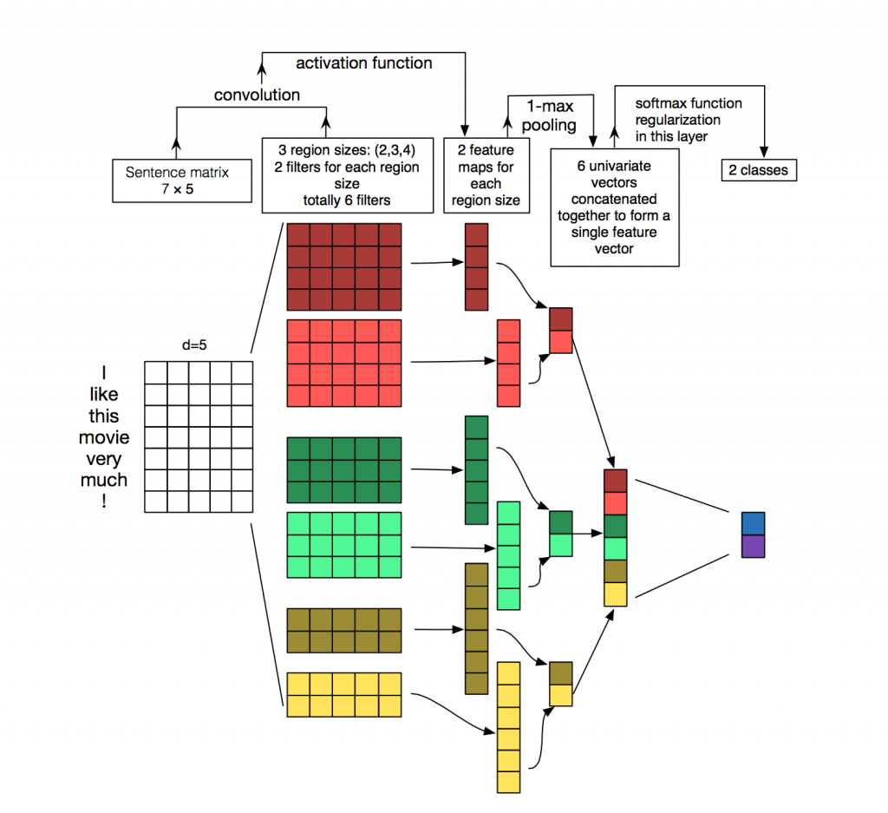
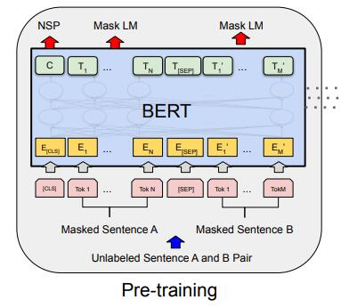
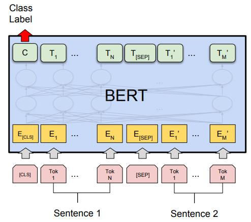
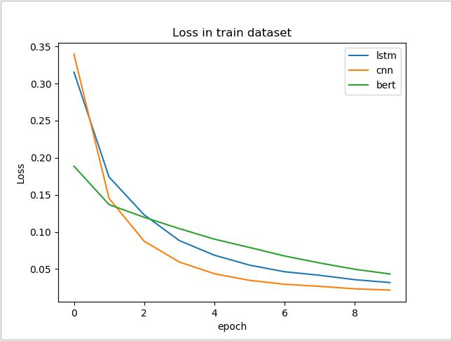
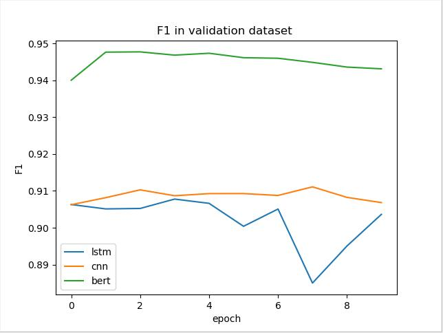

### 深度学习模型PyTorch实践

#### 一、实验目的

使用基于LSTM、CNN、Bert的模型实现文本分类任务，并从模型结构、训练过程、训练结果、测试效果等方面对这三种模型进行分析比较。


#### 二、实验环境

##### 1.硬件环境

CPU：Intel(R) Xeon(R) CPU E5-2640 v4 @ 2.40GHz

GPU：Tesla K80

##### 2.软件环境

Python 3.6 、PyCharm、Pytorch

Xshell、Xftp


#### 三、任务和数据

##### 1.任务

本实验基于百度数据大赛[用户评论情感极性判别](https://dianshi.baidu.com/competition/26)，并采用该比赛的训练数据和测试数据。本实验将比赛提供的训练数据划分成训练集和验证集，并将比赛提供的测试数据作为测试集，通过用训练集和测试集训练出的模型，对测试集进行预测，然后将预测结果在大赛官网上进行提交并评测，获取评测结果。

##### 2.数据

实验数据为用户对商家的评论数据，每一条评论对应有一个情感标签，情感分为正向、中立、负向情感三类。

数据说明：

|  字段名  |                   描述                    |                 样例                 |
| :------: | :---------------------------------------: | :----------------------------------: |
|    id    |                  文本id                   |                  9                   |
|   类型   |              评论的行业类型               |               食品餐饮               |
| 评论内容 |              评论的文本内容               | 现如今的公司能够做成这样已经很不错了 |
|   极性   | 情感极性标签（0：负面、1：中性、2：正面） |                  2                   |

##### 3.评测方法

本任务关注准确率与召回率，采用F1-Score评分。f1评分公式如下：



其中，precision为准确率，recall为召回率， β=1时，准确率和召回率同等重要。

在具体计算时，将三分类问题转化成3个二分类问题的集合，跨多个分类计算每个二分类的加权均值，权重值与标签数量比例一致。


#### 四、实验模型

##### 1.基于LSTM的文本分类模型

###### 1.1 LSTM网络结构

 长短期记忆网络（[LSTM](https://baike.baidu.com/item/LSTM/17541102)，Long Short-Term Memory）是一种时间循环神经网络，是为了解决一般的[RNN](https://baike.baidu.com/item/RNN/5707183)（[循环神经网络](https://baike.baidu.com/item/循环神经网络/23199490)）存在的长期依赖问题而专门设计出来的 。

 LSTM模型核心 在于三个不同的，用于调节 LSTM 单元中的信息流的门结构，即遗忘门、输入门和输出门。 LSTM结构图如下：



  

######  1.2 LSTM文本分类

采用双向LSTM模型处理文本分类问题。

第一步，将文本中的各词的词向量$x_t$分别按正序和逆序输入$LSTM$网络，每个词对应有一个正向的输出向量和一个和逆向的输出向量拼接得到的输出向量$h_t$，然后将各个单词对应的输出向量求平均作为文本的向量表示。

第二步，将第一步得到的文本向量映射成长度为类别数目的向量，并通过一个softmax层进行分类。

模型结构如下：


##### 2 基于CNN 的文本分类模型

###### 2.1 CNN网络结构

 **卷积神经网络**（Convolutional Neural Network, **CNN**）是一种[前馈神经网络](https://zh.wikipedia.org/wiki/前馈神经网络)，它的人工神经元可以响应一部分覆盖范围内的周围单元，对于大型图像处理有出色表现。 卷积神经网络核心结构为卷积层和池化层。

卷积层是一组平行的特征图（feature map），它通过在输入图像上滑动不同的卷积核并运行一定的运算而组成。此外，在每一个滑动的位置上，卷积核与输入图像之间会运行一个元素对应乘积并求和的运算以将感受野内的信息投影到特征图中的一个元素。这一滑动的过程可称为步幅 Z_s，步幅 Z_s 是控制输出特征图尺寸的一个因素。卷积核的尺寸要比输入图像小得多，且重叠或平行地作用于输入图像中，一张特征图中的所有元素都是通过一个卷积核计算得出的，也即一张特征图共享了相同的权重和偏置项。

 池化是卷积神经网络中另一个重要的概念，它实际上是一种形式的降采样。有多种不同形式的非线性池化函数，而其中“最大池化（Max pooling）”是最为常见的。它是将输入的图像划分为若干个矩形区域，对每个子区域输出最大值。直觉上，这种机制能够有效地原因在于，在发现一个特征之后，它的精确位置远不及它和其他特征的相对位置的关系重要。池化层会不断地减小数据的空间大小，因此参数的数量和计算量也会下降，这在一定程度上也控制了[过拟合](https://zh.wikipedia.org/wiki/过拟合)。 除了”最大池化“，还有 “平均池化”，“[L2-范数](https://zh.wikipedia.org/wiki/Lp空间#.E9.95.BF.E5.BA.A6.E3.80.81.E8.B7.9D.E7.A6.BB.E4.B8.8E.E8.8C.83.E6.95.B0)池化”等 。

###### 2.2 CNN文本分类

采用CNN处理文本分类的问题。

第一步：先将一个文本按其中单词的顺序，表示成一个词向量矩阵，然后通过不同的池化层对文本对应的词向量做卷积操作，得到不同的特征向量，接着对得到的特征向量进行池化和拼接，将得到的向量作为文本的表示。

第二步：将第一步得到的文本向量映射成长度为类别数目的向量，并通过一个softmax层进行分类。

模型结构如下图所示：

  

##### 3 基于bert的文本分类模型

###### 3.1 bert模型

 BERT (Bidirectional Encoder Representations from Transformers) 是谷歌开源的自然语言处理模型， 并在问答 Question Answering (SQuAD v1.1)，推理 Natural Language Inference (MNLI) 等 11 个 NLP 任务上的表现刷新了记录。 BERT 可以用于问答系统，情感分析，垃圾邮件过滤，命名实体识别，文档聚类等任务中，作为这些任务的基础设施即语言模型 ， 我们可以对谷歌提供的bert预训练模型进行微调，将它应用于我们的目标任务中 。

BERT 使用了两个策略，一、Masked Language Model (MLM)， 在将单词序列输入给 BERT 之前，每个序列中有 15％ 的单词被 [MASK] token 替换。 然后模型尝试基于序列中其他未被 mask 的单词的上下文来预测被掩盖的原单词。 二、Next Sentence Prediction (NSP)，在 BERT 的训练过程中，模型接收成对的句子作为输入，并且预测其中第二个句子是否在原始文档中也是后续句子。
在训练期间，50％ 的输入对在原始文档中是前后关系，另外 50％ 中是从语料库中随机组成的，并且是与第一句断开的。 在训练 BERT 模型时，Masked LM 和 Next Sentence Prediction 是一起训练的，目标就是要最小化两种策略的组合损失函数。 Bert预训练模型结构图如下：



###### 3.2 bert文本分类

bert会在每个句子的最前面插入一个CLS的标记，最后将CLS对应的输出向量作为句子的表示。在用bert进行文本分类时，我们只要将文本喂给预训练的bert模型，就能直接得到文本的向量表示，然后将此向量映射成长度为类别数目的向量，并通过一个softmax层进行分类。模型结构如下：



#### 五、实验过程

##### 1.数据预处理

先使用pandas工具读取csv格式的训练和测试文件，然后使用jieba分词工具对用户评论数据进行分词，接着根据停用词词典去除用户评论中 像“然而”、 标点符号等只能反映句子语法结构的词语，而不能反映文献的主题的词汇。 

##### 2.模型搭建

分别构建基于LSTM、CNN、Bert的文本分类模型，每个模型包括__init__和__forward__两部分。

##### 3.进行训练

利用sklearn工具对预处理的训练数据进行训练集和验证集的划分，其中验证集数据占总数据的10%。利用搭建的模型对训练集进行训练，并在每一个epoch结束时，对验证集进行测试，将测试结果利用f-score方法计算F1值。保存所有epoch中，验证集F1值最大的模型。

##### 4.进行预测

利用3中保存的最佳模型，对测试集文本进行类别预测，并利用pandas工具保存测试结果到csv文件中。


#### 六、实验结果

##### 1.模型实验结果对比

| model | batch_size | learning_rate | time per epoch | Max F1 in dev |
| :---: | :--------: | :-----------: | :------------: | :-----------: |
| bert  |     20     |     2e-6      |     2777s      |     0.948     |
|  CNN  |    128     |     1e-4      |      17s       |     0.911     |
| LSTM  |    128     |     1e-4      |      46s       |     0.908     |

##### 2.模型在训练集上Loss比较



##### 3.模型在验证集上F1比较




#### 七、实验总结

对于文本分类问题，主要分为文本表示和分类两个步骤。 文本表示即对文本进行特征提取，将一个文本表示成一个向量，分类即将提取的文本向量映射到对应的类别。处理文本分类的模型由很多，而这些模型的最主要区别在于文本表示方面。尤其是对于深度学习模型，分类部分都是通过$softmax$函数，取概率最大的标签作为分类结果。因此，文本表示质量的好坏在一定程度上决定了分类的效果。

本实验，针对百度数据大赛的文本分类任务，分别实现了基于LSTM、CNN以及Bert的文本分类模型，其中基于Bert的模型取得了最好的效果，LSTM和CNN的表现相差不大。此外，CNN模型的训练速度最快，Bert模型的训练速度最大，并且远远慢于CNN和LSTM模型。


#### 附录

1. 基于LSTM文本分类模型代码

   ```python
   class Lstm_Model(nn.Module):
       def __init__(self, word_dict_length, word_emb_size):
           super(Lstm_Model, self).__init__()
   
           self.embeds = nn.Embedding(word_dict_length, word_emb_size)
           nn.init.xavier_normal_(self.embeds.weight)
           self.fc1_dropout = nn.Sequential(
               nn.Dropout(0.25),
           )
   
           self.lstm1 = nn.LSTM(
               input_size = word_emb_size,
               hidden_size = int(word_emb_size/2),
               num_layers = 1,
               batch_first = True,
               bidirectional = True
           )
   
           self.lstm2 = nn.LSTM(
               input_size = word_emb_size,
               hidden_size = int(word_emb_size/2),
               num_layers = 1,
               batch_first = True,
               bidirectional = True
           )
   
           self.fc_ps1 = nn.Sequential(
               nn.BatchNorm1d(word_emb_size),      # 能加快收敛，不会出现开始损失几乎不下降的情况！！！
               nn.Linear(word_emb_size, int(word_emb_size/2)),
               nn.ReLU(),
               nn.Linear(int(word_emb_size/2), 3),
               # nn.Softmax(dim=-1)
           )
           nn.init.xavier_normal_(self.fc_ps1[1].weight)
           nn.init.xavier_normal_(self.fc_ps1[3].weight)
   
       def forward(self, t):
           mask = torch.gt(torch.unsqueeze(t, 2), 0).type_as(t)
   
           # embedding
           outs = self.embeds(t)
           t = outs            #(batch_size, sent_len, emb_size)
           t = self.fc1_dropout(t)
           t = t.mul(mask.type_as(t))
   
           # lstm
           lengths = torch.squeeze(mask, -1).sum(dim=-1)
           _, idx_sort = torch.sort(lengths, dim=0, descending=True)
           _, idx_unsort = torch.sort(idx_sort, dim=0)
   
           t = t.index_select(0, idx_sort)
           lengths = list(lengths[idx_sort])
           t_packed = nn.utils.rnn.pack_padded_sequence(input=t, lengths=lengths, batch_first=True)
   
           t_packed, (h_n, c_n) = self.lstm1(t_packed, None)
           t_packed, _ = self.lstm2(t_packed, (h_n, c_n))
   
           t_padded = nn.utils.rnn.pad_packed_sequence(t_packed, batch_first=True)
           t = t_padded[0].index_select(0, idx_unsort)
   
   
           # mean_pool
           act_len = torch.squeeze(mask, -1).sum(dim=-1)
           act_len = act_len.unsqueeze(-1)        #[batch_size, 1]
           t = t.sum(dim=1) / act_len.float()     #(batch_size, emb_size)
   
           # output layer
           t = self.fc_ps1(t)
   
           return [t, mask]
   ```

2. 基于CNN文本分类模型代码

   ``` python
   class Cnn_Model(nn.Module):
       def __init__(self, word_dict_length, word_emb_size):
           super(Cnn_Model, self).__init__()
   
           self.embeds = nn.Embedding(word_dict_length, word_emb_size)
           nn.init.xavier_normal_(self.embeds.weight)
   
           self.fc1_dropout = nn.Sequential(
               nn.Dropout(0.25),
           )
   
           self.conv1 = nn.Sequential(
               nn.Conv1d(
                   in_channels=word_emb_size,#输入的深度
                   out_channels=word_emb_size, #filter 的个数，输出的高度
                   kernel_size = 3,            #filter的长
                   stride=1,
                   padding=1, #周围围上一圈 if stride= 1, pading=(kernel_size-1)/2
               ),
               nn.BatchNorm1d(word_emb_size),
               nn.ReLU(),
           )
           nn.init.xavier_normal_(self.conv1[0].weight)
   
           self.conv2 = nn.Sequential(
               nn.Conv1d(
                   in_channels=word_emb_size,  # 输入的深度
                   out_channels=word_emb_size,  # filter 的个数，输出的高度
                   kernel_size=2,  # filter的长
                   stride=1,
                   padding=1,  
               ),
               nn.BatchNorm1d(word_emb_size),
               nn.ReLU(),
           )
           nn.init.xavier_normal_(self.conv2[0].weight)
   
           self.fc_ps1 = nn.Sequential(
               nn.BatchNorm1d(2*word_emb_size),        # 当将两个卷积核卷积池化结果拼接起来，不在全连接之前加标准化会迟迟不能找到收敛方向
               nn.Linear(2*word_emb_size, int(word_emb_size / 2)),
               nn.ReLU(),
               nn.Linear(int(word_emb_size / 2), 3),
               # nn.Softmax(dim=-1)
           )
           nn.init.xavier_normal_(self.fc_ps1[1].weight)
           nn.init.xavier_normal_(self.fc_ps1[3].weight)
   
       def forward(self, t):
           mask = torch.gt(torch.unsqueeze(t, 2), 0) #(batch_size, sent_len,1)
   
           # embedding
           outs = self.embeds(t)
           t = outs            #(batch_size, sent_len, emb_size)
           t = self.fc1_dropout(t)
           t = t.mul(mask.type_as(t))
   
           # cnn
           t = t.permute(0, 2, 1)  #(batch_size, emb_size, sent_len)
           act_len = torch.squeeze(mask, -1).sum(dim=-1)   # 可能有句长为0的句子，+1
           act_len = act_len.unsqueeze(-1)                     #[batch_size, 1]
   
           t1 = self.conv1(t)       #(batch_size, emb_size, sent_len)
           t1 = t1.permute(0, 2, 1)  # (batch_size, sent_len, emb_size)
           t1 = t1.sum(dim=1) / act_len.float()  # (batch_size, emb_size)
   
           t2 = self.conv2(t)  # (batch_size, emb_size, sent_len-1)
           t2 = t2.permute(0, 2, 1)  # (batch_size, sent_len-1, emb_size)
           t2 = t2.sum(dim=1) / act_len.float()  # (batch_size, emb_size)
   
           t = torch.cat([t1, t2], -1)
           t = self.fc_ps1(t)
   
           return [t, mask]
   ```

3. 基于Bert文本分类模型代码

   ```python
   class BertForSequenceClassification(BertPreTrainedModel):
     
       def __init__(self, config):
           super(BertForSequenceClassification, self).__init__(config)
           self.num_labels = config.num_labels
   
           self.bert = BertModel(config)
           self.dropout = nn.Dropout(config.hidden_dropout_prob)
           self.classifier = nn.Linear(config.hidden_size, 		                               self.config.num_labels)
   
           self.init_weights()
   
       def forward(self, input_ids, attention_mask=None, token_type_ids=None,
                   position_ids=None, head_mask=None, labels=None):
   
           outputs = self.bert(input_ids,
                               attention_mask=attention_mask,
                               token_type_ids=token_type_ids,
                               position_ids=position_ids, 
                               head_mask=head_mask)
   
           pooled_output = outputs[1]
   
           pooled_output = self.dropout(pooled_output)
           logits = self.classifier(pooled_output)
   
           outputs = (logits,) + outputs[2:]  
   
           if labels is not None:
               if self.num_labels == 1:
                   #  We are doing regression
                   loss_fct = MSELoss()
                   loss = loss_fct(logits.view(-1), labels.view(-1))
               else:
                   loss_fct = CrossEntropyLoss()
                   loss = loss_fct(logits.view(-1, self.num_labels), labels.view(-1))
               outputs = (loss,) + outputs
   
           return outputs  # (loss), logits, (hidden_states), (attentions)
   ```

   