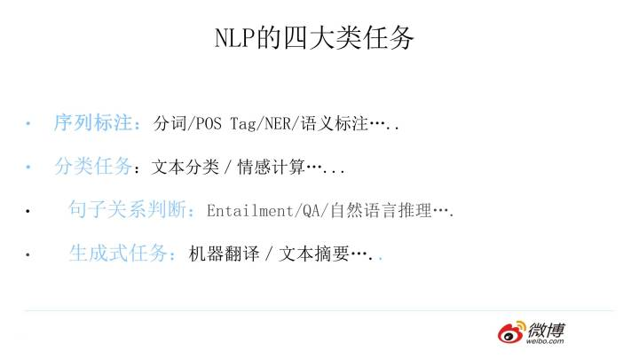

### 知识总结（NLP)

#### 1.NLP四大类任务

引用自： https://zhuanlan.zhihu.com/p/54743941 

#### 2. NLP特征抽取器

- $CNN$
  - CNN捕获的是n-gram片段信息（n为卷积核尺寸，即覆盖的单词的数量），单卷积层无法捕获远距离特征。
  - CNN没有序列依赖关系，适合并行。
  - CNN的卷积层会保留序列相对位置信息，但是pooling层一般会破坏这一点，因此有时也需要在CNN网络中添加位置编码。
  - CNN捕获远距离特征的方式：
    - 增大卷积核大小
    - Dilated CNN （膨胀卷积）
    - 加深CNN网络深度

- $RNN \to LSTM、GRU \to RNNs+Attention$

  - RNNs天然适合不定长的线性序列结构，不需要位置向量加持。
  - 传统RNN存在**梯度消失**、**对长期依赖不敏感**的问题，使用LSTM、GRU能得到一定的缓解。

  - RNNs  + Attention机制，能更进一步学习长距离的信息。

-  $Transformer （self-attetion）$

  - 优势： ①**并行能力** 、②捕捉长距离信息和特征抽取能力（self-attention）
  - 劣势：不能很好的体现序列的先后关系，添加位置向量（ position embedding ）进行弥补

#### 2.深度学习一些trick

- 参数初始化（正态分布>平均？）
- 标准化（batchnormal、layernormal)

$$
y = \frac{x - \mathrm{E}[x]}{\sqrt{\mathrm{Var}[x] + \epsilon}} * \gamma + \beta
$$

- 残差连接
- Highway
- warm up
- learning_rate、batch_size影响

#### 问题荟萃

##### 1. 为什么LSTM能缓解梯度消失？

每一个时刻的输出为输出门系数\*（遗忘门系数\*当前学习到的信息+更新门系数\*上一时刻的记忆），其中的系数计算，加法运算等，增加了梯度回传的路径。即链式求导路径增加，对同一参数，不同路径所求偏导相加，使得梯度较一条路径大，不易接近于0。

##### 2. 将预先训练好的语言表示应用于下游任务的两种策略？

-  基于特征的方法（**feature-based**）

 (1) Feature-based指利用语言模型结果，将其作为**额外的特征，引入到原任务模型中**。 如  ELMo 

 (2) Feature-based步骤：

1. 先在大的语料上进行无监督的训练语言模型，得到语言模型。
2. 根据任务，构造特定的任务模型，将**语言模型的参数固定**，下游任务语料经过语言模型得到的Embedding等信息作为任务模型的额外特征，再训练任务模型。

- 基于微调的方法（**fine-tuning**）

(1)  Fine-tuning是在已经训练好的语言模型基础上，加入少量具体任务的参数，例如对于分类问题在语言模型基础上增加一层softmax网络，然后在任务的语料上重新训练，从而fine-tuning参数。

(2)  Fine-tuning步骤：

1. 先在大的语料上进行无监督的训练语言模型，得到语言模型。
2. 在语言模型基础上增加少量神经网络层，使得任务模型适应特定下游任务。然后使用任务语料训练模型，这个过程语言模型的参数并不固定，也会一起更新。

Note：**Feature-based和Fine-tuning最大区别**在于是否将语言模型作为下游任务模型的一部分，是否进行训练更新。